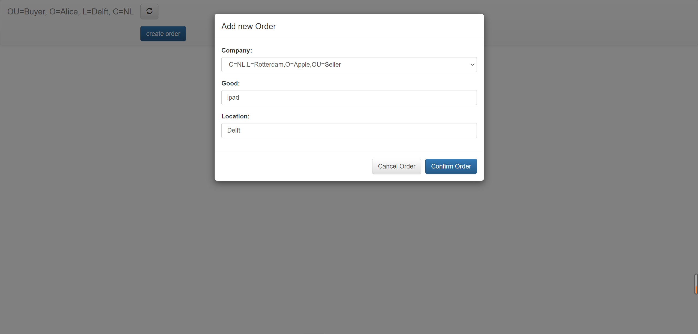
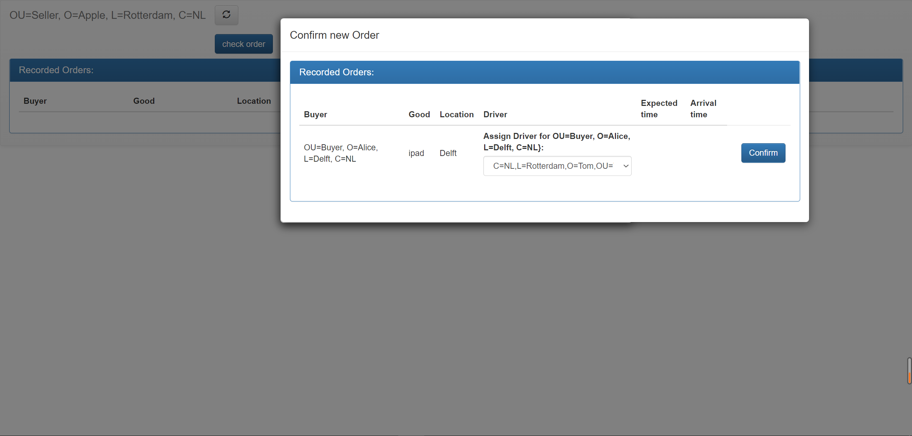
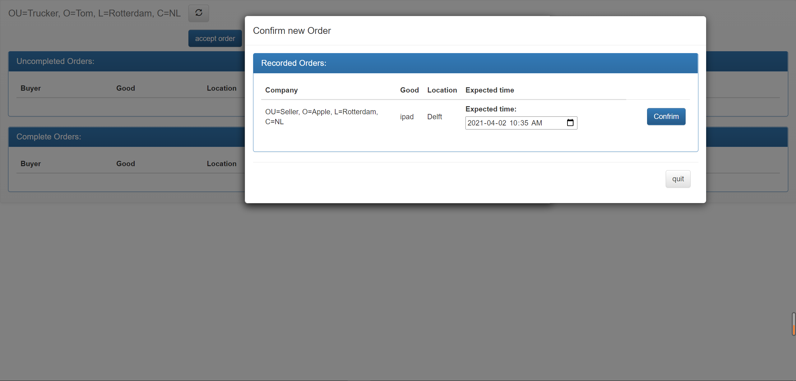
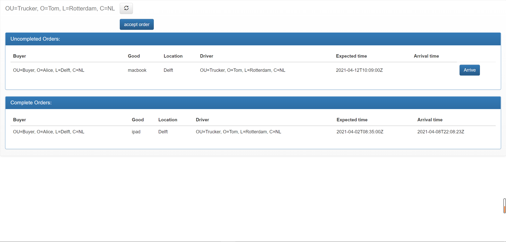
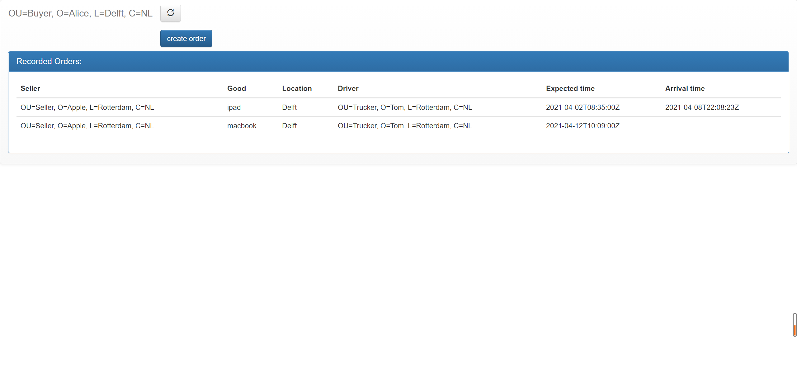

# A Corda-based Supply Chain Visibility Design

This CorDapp shows how our supply chain visibility blockchain network could complete the transport process.
The Customer, Supplier, and Trucker Interfaces are also available in our CorDapp. 
We follow the guideline of [CorDapp Design Language (CDL)](https://docs.corda.net/docs/cdl/cdl/cdl-overview.html) to implement our project. 
To understand the implementation, please refer to the following Lucid Chart: 
[Smart Contract View](https://lucid.app/lucidchart/invitations/accept/inv_75dc8f10-9a36-4762-ba91-107cf0e62fe9), 
[Ledger Evolution View](https://lucid.app/lucidchart/invitations/accept/inv_48f547bc-27c0-41c2-b5f3-c0a79674b650) and 
[Business Process Modeling Notation View](https://lucid.app/lucidchart/invitations/accept/inv_4d6a74c1-9afd-4bcc-986d-31e696bc2dd7).

## Usage
Please follow the instruction on [Get started with Corda](https://ubuntu.com/tutorials/get-started-with-Corda#1-overview) for installation on Ubuntu.

Note: you may also check the software requirements for Corda on [Corda website](https://docs.corda.net/docs/corda-os/4.7/getting-set-up.html).


### Environment
Ubuntu 18.04 


### Network Map Service

The network map service is cloned from this Github https://github.com/roastario/spring-boot-network-map. Although the author provides an example of using docker, we prefer not to use docker right now. It would be much easier to run shell script directly. 

In the following instructions, we will run a network map service first and then add nodes to the network one by one.

#### STEP 1: Build network map servie and create a notary

```bash
cd <path-to-CS4160>/Corda-based-Supply-Chain-Visibility-Design/supplychain-cordapp/network_map_service/
./run_build_notary_nms.sh
```

#### STEP 2: Run network map service
```bash
./run_network_map_service.sh
```

#### STEP 3: Run notary
```bash
cd notary
sh run-node.sh
```

#### STEP 4: Build the Cordapp Template Nodes
The predefined nodes are configured in <path-to-CS4160>/Corda-based-Supply-Chain-Visibility-Design/supplychain-cordapp/
build.gradle 
```bash
cd <path-to-CS4160>/Corda-based-Supply-Chain-Visibility-Design/supplychain-cordapp/
./gradlew deployNodes
cd network_map_service/
cp -r <path-to-CS4160>/Corda-based-Supply-Chain-Visibility-Design/supplychain-cordapp/build/nodes/${PartyName} Template
```

#### STEP 5: RUN the NEW Registered Node

Before we run the script for cloning, we need to carefully edit several variables in run_clone_node.sh. 
There are five examples written in config_demo.txt. Please note that the port should not be reused. In other words, you need to use a different port for different nodes.
```bash
CLONED_NODE_NAME="Template"
NEW_NODE_NAME="Alice"
NEW_NODE_CONF_NAME="O=Alice,L=Deflt,C=NL,OU=Buyer"
PUBLIC_ADDRESS="127.0.0.1"
P2P_PORT="10005"
RPC_ADDR_PORT="10006"
RPC_ADMIN_ADDR_PORT="10046"
```
After the configuration, we can clone and register the new node to the network map server now.
```bash
./run_clone_node.sh
```

Configuration and registration above are only required for new nodes. Next time when you run a registered node, you should directly execute the command below.  
```bash
cd ${NEW_NODE_NAME} 
java -jar corda.jar
```

#### STEP 6: 
Repeat the step 5 to create other nodes according to the configuration in config_demo.txt.

#### STEP 7:
After having added new nodes, we should add several task `runNodeNameServer` commands manually in the `build.gradle` file in the clients folder. At this step, we will remember the RPC connection address of each new added nodes. An example of commands is shown as follows:
```kotlin
task runAppleServer(type: JavaExec, dependsOn: jar) {
    classpath = sourceSets.main.runtimeClasspath
    main = 'net.corda.samples.supplychain.server.ServerKt'
    args '--server.port=10069', '--config.rpc.host=localhost', '--config.rpc.port=10017', '--config.rpc.username=user1', '--config.rpc.password=test'
}
```
If we want to establish the server for each new nodes, we can simply change the`--config.rpc.port` to the corresponding RPC connection address, and the `--server.port` that is set to be as the front-end port which should be differentiated with each other.
Note: the `--config.rpc.username=user1` and `--config.rpc.password=test` should be as same as the username and password set in build.gradle file in root folder. And `--config.rpc.port` should be the one you set in the step4.

### Running the CorDapp

You can run our CorDapp and interact with it via a web server. (Our default `build.gradle` file has defined 10 nodes, it may cost you lots of memory, you can reduce the number of nodes by modifying the `build.gradle` file. )

Open a terminal and go to the project root directory and type:
```
./gradlew clean deployNodes
```
Then type:(to run the nodes we have added in the Network Map Service part)
```
./build/nodes/runnodes
```
#### Starting the webserver
Once the nodes are up, we can start the webservers next. Generally, this app consists of one notary and several nodes. The number of nodes depends on how many nodes are added in the Network Map Service procedure.

For instance, we assume there is one buyer node named Alice, one seller node named Apple, and one trucker named Tom.
We should start 3 webservers separately. Open a new tab of the terminal(make sure you are still in the project directory)
and run:

```bash
./gradlew runAliceServer
```
and 

```bash
./gradlew runAppleServer
```
and
```bash
./gradlew runTomServer
```

#### Interacting with the CorDapp
Once all three servers have started up (look for `Webserver started up in XXX sec` in the terminal), you can interact with the app via a web browser.
* From a Node Driver configuration, look for `Starting webserver on address localhost:100XX` for the addresses.

For instance, as for Node Alice:`localhost:10066`, you could see the buyer interface in the webserver as follows:


The customer could create an order by clicking the button "create order" at the top of the page. Thencustomer could input order information to create a new order. Significantly, Only the supplier’s information is visiblewhen a customer chooses a supplier.

For Node Apple:`localhost:11000`, you could see the seller interface in the webserver as follows:


The Supplier could assign a trucker to a specific order after clicking the " check order" button.Similarly, Only trucker information is visible when the Supplier assigns a trucker to an order.After assigning the trucker function, all the order information will be displayed on the supplier page for tracking theorder information.

For Node Tom:`localhost:10070`, you could see the Trucker interface in the webserver as follows:



As the above images show, the Trucker Interface consists of two main parts: Uncompleted Orders and Complete Orders. Initially, As we can see in the Trucker interface, the trucker can click "accept order" button to check all orders assigned to this trucker.  Subsequently, the trucker inputs the expected time to a specific order and starts shipment. All the orders that are in the shipment will be present in the uncompleted orders. A trucker can click "arrive" button when the shipment has been completed, after which time this order is shown in the completed order area. As the requirement of this project, all the buyer’s information is invisible in the trucker interface.

In the Customer Interface, the information of order that this customer creates can be updated synchronously.

